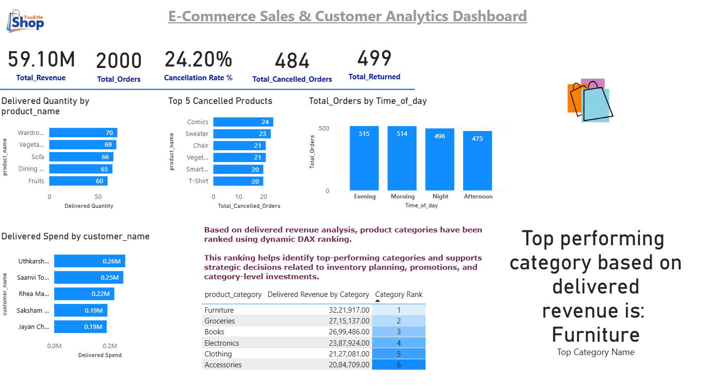

# Sales Store Analysis – Business Insights Dashboard
A comprehensive end-to-end analytics project showcasing data analysis and visualization using SQL and Power BI to provide business insights for a retail sales dataset.

## Project Overview
This project demonstrates the full life cycle of data analytics:

1.Data exploration and business problem framing
2.SQL based data analysis and metric creation
3.Translation of business logic into DAX measures
4.Interactive Power BI dashboard design
5.Storytelling with insights — not just charts
6.Interpretation for informed business decisions

📌 Goal: Identify meaningful trends in sales, customer behavior, product performance, and operational issues such as cancellations and returns.

## Dataset Description
| Column	|               Description
| transaction_id	|       Unique order identifier
customer_id	Unique customer identifier
customer_name	Customer name
customer_age	Age of the customer
gender	Customer gender
product_id	Product identifier
product_name	Product name
product_category	Category of the product
quantity	Units sold
price	Price per unit
payment_mode	e.g., UPI, Card
purchase_date	Date of purchase
time_of_purchase	Time transaction occurred
status	Order status (delivered/cancelled/returned)

### Screenshots / Demos

